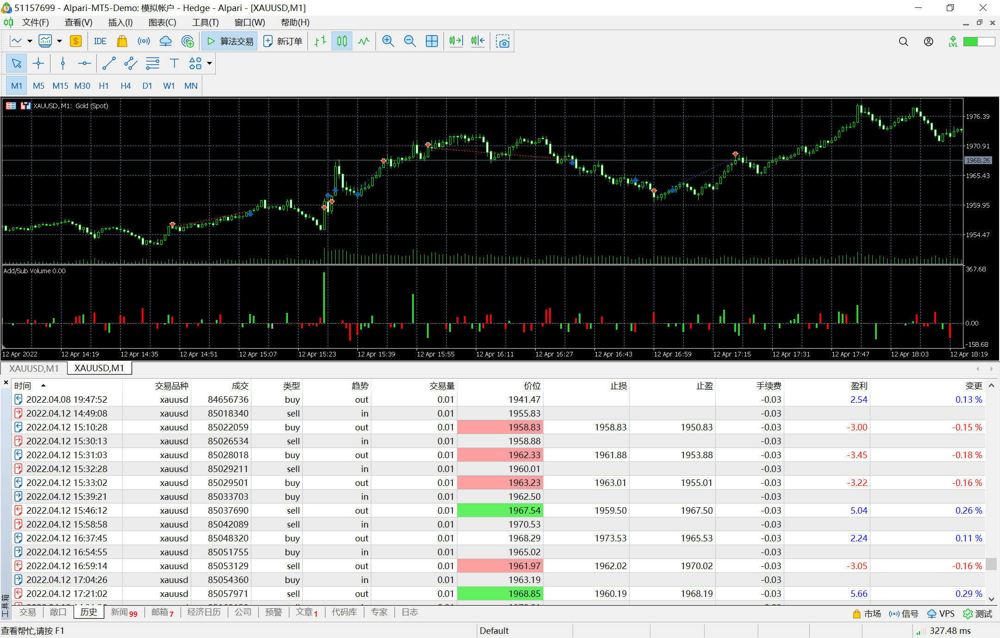

# 12

source: `{{ page.path }}`

## 未注意宏观事件

一直在看空, 在北京时间20:30, 行情突然暴涨, 没有注意, 继续做空, 结果被连续止损. 

后来查询发现美国公布CPI数据, CPI达到近十年最高, 通过根据python数据分析结果, 美国CPI数据公布后是会有大幅波动的. 

后来连续做多, 又挽回部分损失.

这次犯了错, 希望以后引以为戒.

