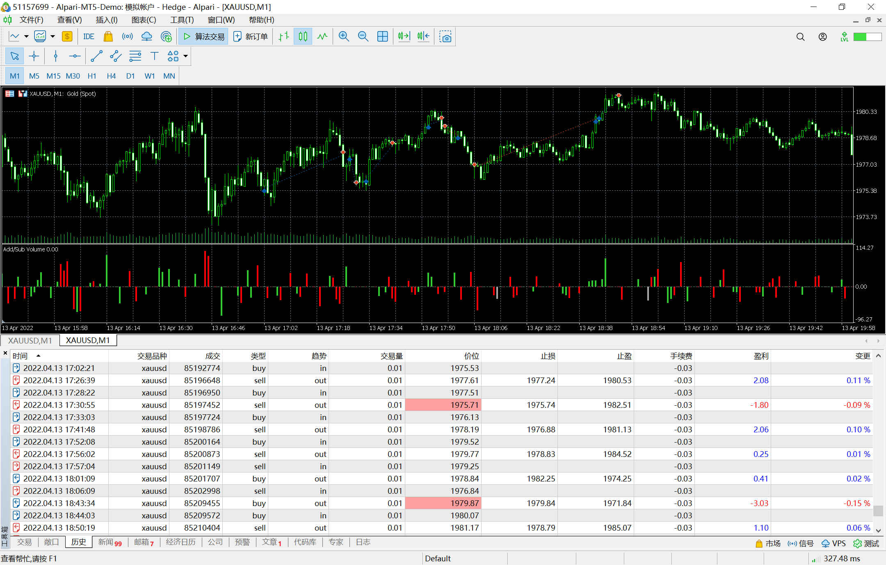

# 13

source: `{{ page.path }}`

## 目标不坚定

今天看完了书籍<订单流交易 有趣又赚钱>, 启发颇深, 刚好遇到晚上行情.

上方在1980位置多次掉头向下, 每次下跌非常迅速, 下方在多个不同价位又缓缓向上爬升. 按照数据介绍, 价格会朝着止损单密集方向移动.

我判断开始两单22:00之后开始交易, 判断价格最终会突破1980, 但是中间价格波动非常曲折.

有过两笔短暂的赢利交易后. 价格再次从1980掉头向下. 我开始认为价格会下跌了(我的目标动摇了), 因此开始做空, 最终两次被止损, 最后价格终究还是突破1980.

