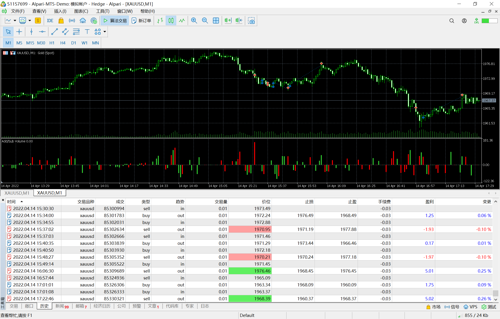

# 14

source: `{{ page.path }}`

## 交易顺利

今天交易的较为顺利. 
第一, 我做好了准备并等待20:30发布宏观数据. 
第二, 并判断正确了三波行情.

## 小插曲
1. 在宏观数据刚发布时并不确定行情方向, 于是做了几次小测试.
2. 在21:50之后的一波下跌中抓住了行情的尾巴, 但是最低点没有打到我的止盈点, 造成了盈利大幅回撤.

## 时机之锁

在21:57的那笔交易
1. 我本来应该在21:53入场的. 
2. 行情达到最低点1960.33然后转折, 离我预设的固定止盈点只有不足0.5美金的差距. 当我看到行情转折后, 我平仓了.
3. 平仓理由有两点: 一, 价格在1960这个整点附近转折, 二, 一波大幅下跌一直持续到22:00整点. 
4. 我曾多次看到趋势持续到整点结束, 希望以后能多注意.

