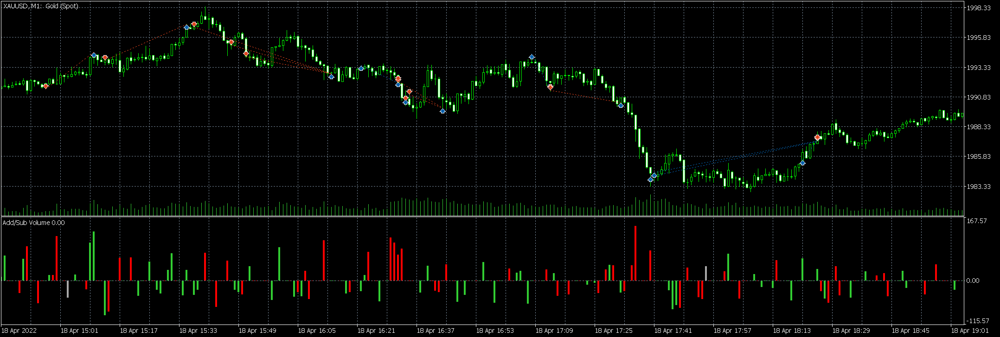
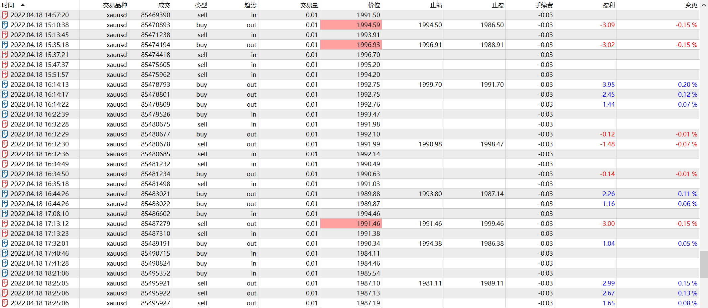

# 18

source: `{{ page.path }}`

## 波动小, 有失误

今天是周一, 明显可以感觉到行情波动不大.
第一笔交易做了空单, 前期高点在1993, 可能是单纯看空了, 然而很快就止损了. 价格已经突破了近期高点, 考虑到今天是周一, 成交量和波动都不大, 这个价格突破是没有说服力的, 仍然看空, 又被止损了, 价格突破1996, 这已经是月内新高了, 我仍旧看空, 然后是第三次入场做空.

### 突破增仓

周末读完了《股票大作手回忆录》和《股票大作手操盘术》,非常喜欢利弗莫尔的逐步加仓方法, 因此摒弃了原来的单笔固定止损, 尝试使用突破加仓.

### 未及时平仓

当价格跌至1991时, 我观察到之前一段时间价格并没有在1990这个比较敏感的价位停留, 因此判断价格必会跌破1990, 最后一次加仓做空. 价格确实跌破了1990, 最低跌至1989, 但是没想到停留时间只有不到1分钟就反弹了,错失了最佳平仓时机后眼看着价格大幅回升, 但是没有突破前期高点, 耐心等了一会, 又回调下来, "幸运"平仓.
但是并不是每次都能有很好的运气, 因此以后再遇到这种情况, 既然判断价格必会跌破1990, 必须在跌破的那一瞬间就平仓, 至少应该将由这个原因增加的仓位平掉.

### 做错单

经过上一番折腾后, 我判断短期震荡区间在1990-1993, 由于震荡区间太小, 我放弃了入场交易, 等待行情突破这个区间. 此时, 我对多空方向也是不大有把握的, 因此, 在行情突破前期高点时, 入场做多. 但是这笔交易有些鲁莽. 1. 并未完全确认突破, 因此多在了最高点. 2. 即使真的突破, 但是当前价格已经突破1994, 离前期最高点1997只有很小的赢利空间, 盈亏比也非常不合适.

这笔错单的主要原因是没有计划好.

### 做对单

今天行情波动太小了, 正如之前所说, 经历来回折腾后, 行情波动一直不温不火, 我打算写完日记休息了. 但是没想到, 不经意间行情跌破了1990, 当我看到的时候已经跌破了1986. 我想追空, 但是感觉有些为时已晚. 
看着突然大幅下跌的行情, 我认为, 之后有机会做多, 当前价格在1985附近, 我脑子闪过一丝做多的冲动, 但是"直觉"告诉我最低点应该在1983附近.
果然不到2分钟, 跌至1983, 我入场做多, 今天行情波动很小, 同时短期大幅下跌, 考虑这两点, 我做多了2手.
行情又开始了横盘, 而且在1983最低点长时间徘徊, 偶尔跌破最低, 但是我知道不能因为跌破最低主动止损, 即使当前不是最低点, 也离最低点不远.要么等待主动止损, 认赔离场, 要么继续等待反转. 
横盘中出现了三个关键点, 1986.45, 1985.25和1984.75, 盘面表现很弱势, 因此根据我的判断, 当价格突破1984.75, 表示有上涨的可能, 突破1985.25基本确定会上涨, 而且会接着突破1986.45. 因此当行情突破1985.25时, 我最后一次加仓. 
盘面果然如所料, 我心里目标价格在1988, 但是行情波动太小, 而且当前持仓较多, 因此当价格突破1987时我便全部平仓了.

总体交易是比较顺利的.

## 总结

投机是一门生意, 还是得用心! 今天晚上有些地方做的不够好, 部分原因就是没有用心. 头脑不能保持清醒.

