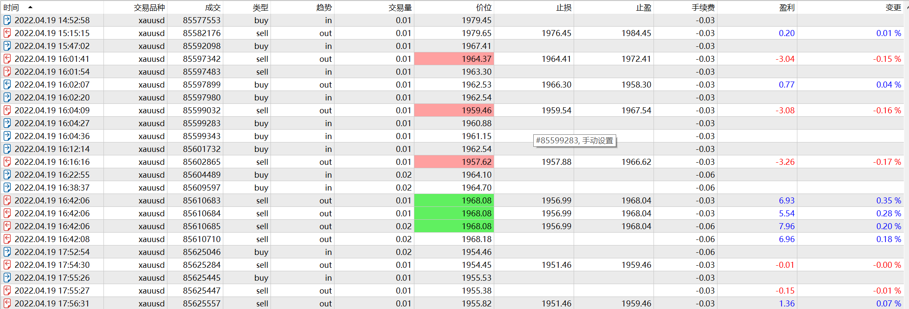

# 19

source: `{{ page.path }}`

## 记一件小事

昨天提到价格接近2000时, 我做空的判断. 今天无意间看到一条新闻"金价将再次突破2000". 结果晚间金价突然大幅下跌20美元.

## 基本信息

周二, 无新闻

## 错误抄底

话说20:44分, 无意中价格跌破前期低点, 我想入场做空, 但是错过了最佳追空的时间.于是等待抄底, 我预判这次低点应该在1965左右. 入场做多后价格果然在当前价附近横盘. 有两件事值得记录:

第一, 我希望寻找到一个前期1965附近的支撑点, 但惊讶的是一时间竟找不到.唯一一个较明显的支撑在1960(1H).

第二, 20:49的反弹力度很弱.

不久价格继续下跌, 我被止损, 我继续看多, 又被止损, 价格已经跌到1958.

事实证明, **没有明显支撑的抄底行为是危险的**.

## 顺势加仓

下跌至此, 已经跌到前期明显支撑点, 同时成交量也明显放大, 我判断当前应该是底部, 加仓1手. 

哪里是价格回升关键点?

我判断应该是1962.45, 于是价格突破1962.45时加仓1手, 但是接着价格又回调了. 我知道我错了, 价格关键点应该在1963.52. 这次回调跌破了前低, 我被止损了1手.

但是迅速反弹的价格让我更加确信当前就是底部, 于是价格突破1963.52加仓2手.之后价格又开始回调, 但是我并不紧张. 确定下一个关键点1964.40, 价格突破时继续加仓2手(本应该1手, 忘调了)

我的目标价价位在1968.11, 全部持仓都设置在此, 不就全部顺利止盈.

## 成功总结

这次交易持仓很重, 但是我觉得还是较为成功.原因如下:
1. 方向明确, 做多.(没有任何新闻刺激, 平白无故大幅下跌, 做反弹应该是比较明智的)
2. 底部明确, 虽然多次被止损, 而且有假突破, 但是前低的支撑价在1960, 假突破后迅速反弹, 成交量的明显放大. 都让我确信这是底部.
3. 关键点明确, 我总是在寻找下一个关键点. 并在关键点突破后加仓.
4. 止盈明确, 止盈点并没有特别多的依据, 但实际上从后来情况看, 我是止盈在了最高点.
   
如果没有以上几点, 我冒险重仓做多, 是有些激进, 但是我的各方面理由都很充分. 轻仓并不代表稳重, 重仓也不表示冒险, 冷静的分析判断, 才会有足够的勇气.

