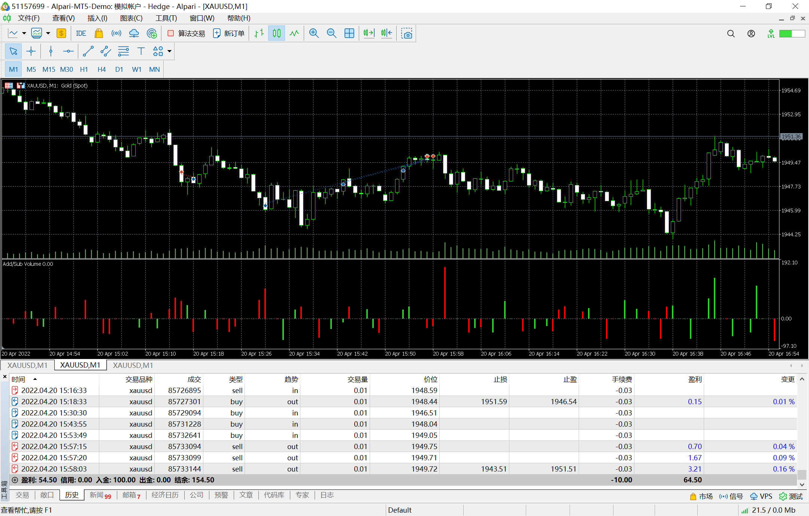

# 20

source: `{{ page.path }}`

## 基本信息

周三, 20:30发布重要数据. 波动小, 趋势性弱

## 耐心等待

在20:30之前, 有想过进场的, 但终究克制住了. 20:30之前, 价格便出现了"破位"下跌. 

数据公布后, 价格并没有立即出现大幅波动, 因此我判断价格会回升. 

1. 首次入场1手
2. 确定上升关键点1947.96, 下buy_stop订单
3. 确定第二个关键1948.99, 下buy_stop订单
4. 确定离场关键点1950.55, 未能突破, 平仓离场

