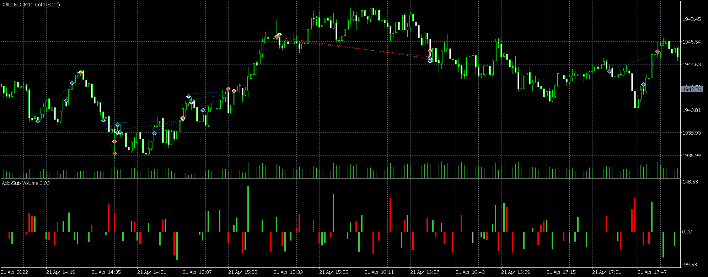
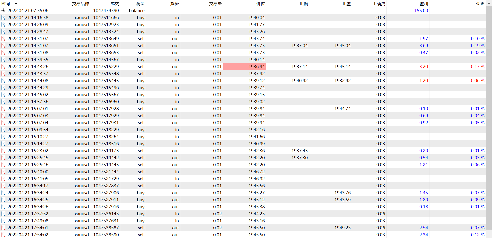

# 21

source: `{{ page.path }}`

## 基本信息

首次实盘, 周四, 20:30发布经济数据, 波动增强, 趋势弱, 成交量大.

## 稍有紧张

19:16的第一次交易是很顺利的, 首次入场, 突破加仓, 再突破再加仓, 然后止盈离场.

19:39, 价格跌至1940附近, 根据1H判断, 1939附近有较明显支撑. 于是入场做多.

19:43, 价格异常波动, 我被止损, 由于价格已跌至1937附近, 我估计已经破位, 于是在被止损后反手做空, 但是收盘却出现长下影线. 我判断底部出现, 于是平空并加仓做多.

但是价格并没有快速回升, 反而继续回调, 不知是实盘原因还是判断偏差原因, 此刻有些慌乱; 不知是慌乱原因还是坚信底部出现, 我取消了止损.

令我深感意外的是, 价格继续回调, 逐步接近下引线最低点, 此刻心态有些崩溃.于是暗下决心, 只要能顺利离场就好.

20:05, 那根K线没有突破前一个阻力点, 我冒然全平了. 结果后面价格继续走高, 我知道自己做错了, 并深感后悔, 之后我认为价格会继续走高, 于是高位追多. 当我看到成交价在最高点时, 才发现当前点差已经达到40左右了, 更可笑的是我刚入场, 价格又开始回调, 这时我已经不敢设止损了. 

**手里握着大量没有止损的裸头寸, 内心一定很崩溃!**

于是, 在价格回升至成本价附近, 又平仓离场了. 当然, 这一次平仓还有一个比较重要的原因是20:30新闻数据快公布了.

之后, 价格快速上涨, 但是都与我无关了. 

由此总结一条交易原则, **不要随意入场**

## 不要随意入场

20:40, 根据K线形态判断, 和1H线显示1949附近有阻力点, 判断局部高点出现.

**我知道顶部不会一蹴而就, 然而仍然没能忍住入场做空**, 价格继续上涨, 我再次默默取消了止损, **手里握着大量没有止损的裸头寸, 内心一定很崩溃!**

虽然价格在高位徘徊, 但是成交量没有明显放大, 这增加了我对当前是顶部的信心, 但是**手里握着大量没有止损的裸头寸, 内心仍然很崩溃!**

我判断下跌关键点在1945.58, 设置了一个sell_stop, sell_stop并不代表我对市场看空, 它只是提醒我若最后一笔空单入场, 无论如何该平仓了.

今天的行情很不流畅, 由于入场点不好, 我的内心也很煎熬, 但是总算熬到行情缓慢下跌, 跌到最后一笔入场空单触发后, 我迅速平仓了.

如果之前的交易我没有及时总结反思, 后来的交易行为再次提醒我**在不流畅的行情中, 不要随意入场**.

## 犯错, 自救

经历上述波折, 原本不打算继续交易, 但是稍作休息后还是忍不住打开行情看板.

22:37, 我发现价格刚好回调至1942附近反弹, 然后以微弱的力度突破了前一个小阻力点.

1492是20:30是今晚数据公布时间点, 也是成交量首次暴增的时间点, 同时是我之前判断的回调阻力点. 正确的判断给了我入场信心. 但是入场后行情再次开始回调, 在即将接近止损点时我才发现自己居然下单了2手, 这是之前下单时忘记修改回来了, **无论如何, 我犯错了**.

**成功的交易者不会对已发生的事实自怨自艾, 而总是快速思考如何脱离困境?**

当价格跌破前低时, 脑海中快速闪过两个念头:
 1. 今晚行情总体震荡为主
 2. 今晚多次出现假突破
 3. 前一个被突破的阻力点暗示行情有上涨动力

总结一句: 此刻被止损是不明智的, 因此删除了止损.

后来事实证明我的判断是对的, 在价格回升突破上一个阻力点时, 再加仓1手(顺便修改默认下单手数), 最后价格接近前一个阻力点时, 平仓离场.

## 盘后总结

今天是周四, 成交量比前两天是有放大的, 正常来讲交易应当是异常活跃的, 然而今天行情反复震荡, 多次假突破. 

我猜想应当是多空激烈斗争的结果, 如果未来价格突破1950, 可能暗示多头赢得了主动权; 如果未来价格跌破1936, 可能暗示空头赢得了主动权.

