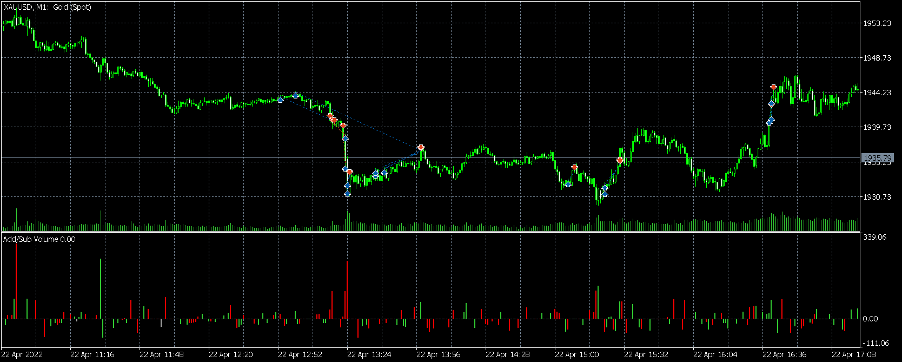
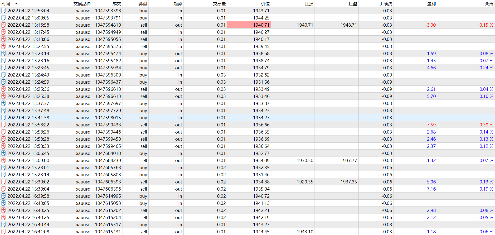

# 22

source: `{{ page.path }}`

## 盘前准备

周五, 波动大, 无经济数据
(今天交易时间较早, 个人感觉20:30之前交易量不大, 但是运行py程序发现成交量高于均值.可能是成交量没有局部放大造成的错觉)

## 一半成功

昨天预测"如果未来价格突破1950, 可能暗示多头赢得了主动权; 如果未来价格跌破1936, 可能暗示空头赢得了主动权."但结果是今天白天价格突破了1950, 晚上又跌破了1936.

今天看盘时间较早, 17:53做了第一笔交易, 由于白天价格突破1950, 内心偏多思想. 同时价格回调至前低附近, 又以小幅优势突破前一个阻力点, 自然做了多单.

这里犯了错, **因为主观意愿看多, 忽视了突破很弱**, 并做多了2手, 不久价格跌破, 其中1手被止损, 同时我反向做空了2手. 1手锁仓单, 1手趋势单. 最后追加了1手sell_stop(这应该是最漂亮的操作).

其实这里我不大敢看空的, 理由有二
1. 当前还不到19:00, 成交不活跃, 容易出现假突破.
2. 底部支撑点比较多, 1H支撑有1940, 1939和1936, 任意一个点位反弹都有可能.(这里再次证明了那句话, **当我不知道价格的支撑和阻力时, 市场也不知道**)

因此18:22那根下破的阴线出现后我平掉了2手空单, 还剩一对对冲单. 

我本以为下方支撑会在1936附近. 18:43, 价格再次大跌, 习惯性平掉了对冲的空单, 剩余1手裸多单. 当前价格已经跌破1936.

下一步支撑在哪?不知道, 已经没有支撑了, 不过当时也没时间想这些事情. 18:44, 价格继续下跌, 开始大量做多做多, 连续两次做多3手, 18:45, 价格反弹, 平掉6手多单, 仍剩余最后1手裸多.

### 惊魂时刻总结

我清楚的记得18:17那根十字K线出来之后的几分钟我一直在犹豫: 底部是否出现, 是否要平掉空单?

不过理智告诉我, 如果价格突破十字K线最高价, 说明向下突破失败, 我将会大量做多; 如果价格跌破十字K线最低价, 说明底部还未出现, 我将继续做空. 因此我在最高价和最低价分别挂了buy_stop和sell_stop. 结果sell_stop被触发(未如我所愿).

**正确的操作比正确的判断更加重要**

最后价格一再下跌, 我知道超跌了. 从1952跌至1930, 接近22美元的跌幅, 而现在还未到19:00.

于是我在超跌之后, 又在前一阻力点大量设置buy_stop, 我预计阻力点在1936附近, 这是昨晚最低点. 

大量没有止损的多单, 此时内心是较慌乱的, 尤其是在18:49-18:55那几分钟, 看着上涨受阻, 略感紧张, 好在理智战胜了恐惧. 

这里理智战胜恐惧我认为有一个很大的原因是, 我追加的单子都是buy_stop成交的, 它暗示我当前买入的力量较大

再一次证明, **正确的操作永远比正确的判断更加重要**

## 捡钱的机会

由于之前一波已经实现了今天的小目标, 而且当前价格确实跌破了所有的支撑, 而价格跌幅又较大, 多空都不划算, 所以本不打算继续交易了.

### 捡钱1

20:06, 价格又快速下跌到了前低附近, 可能是凭本能, 做多1手, 但是20:08, 那根大阳线出现, 好像是在告诉我"快止盈吧". 为什么呢?因为价格跌破所有支撑, 当前还是空头趋势, 怎么就突然出现一根那么扎眼的大阳线呢.

### 捡钱2

我是不想继续交易了. 可是20:19价格又向下跌破了日内最低点, 也是近期最低点. 我本打算跌破后继续抄底的, 因为我知道, 今天价格已经超跌了, 所以不可能做空. 

但是, 更有趣的事情发生了, 价格下破之后居然又涨回来了, 伴随着明显放大的成交量, 它告诉我, "下破失败, 底部已现", 于是我连续做了4手多单.(其实, 如果不是今天已无斗志, 这里我应该会做多的更多. 失败的下破, 明显增加的成交量, 不断突破前一个小阻力, 我当时唯一的想法: 这就是一个捡钱的机会.)

20:29, 价格上涨受阻, 其实我本可以持仓更久的, 因为我知道自己抄到了底, 没必要跑这么快, 但还是那句话, 无心斗志, 落袋为安!

### 捡钱3

我已经多次表达自己今天不想继续交易了, 以至于在开始编写日记时, 21:19, 看, 又是一个捡钱的机会, 可我直接放弃了.

但是21:39, 明显的一个突破, 它意味这当前价格已经脱离了下跌区间. 我之前一直认为价格上涨阻力在1938-1940一段, 如今它居然当着我的面突破, 这就不是捡钱, 而是直接把钱送到手里.

毫无疑问加仓做多, 我本以为做了2手, 没想到做了4手, 好吧, 1分钟之后又落袋为安. 其实我还是看多, 同时需要调整默认下单手数, 于是高位做多1手, 然后止盈离场. 

## 盘后总结

今天做了很多笔交易, 但其实第一波做的不好, 一波暴跌, 我做对了方向, 但却过早平仓. 不过对自己应急的操作还是比较满意的, 如果换做以前, 早就赔大了.

第二件事就是我并没有特别认真对待后面的行情, 今天其实是一个非常好操作的环境, 以至于我描述了三次捡钱的机会(与此相对, 昨天比较难操作).

有句话叫"天予不取,反受其咎", 如果以后再遇到这种情况, 即使是怕赔钱, 也需要认真对待.

