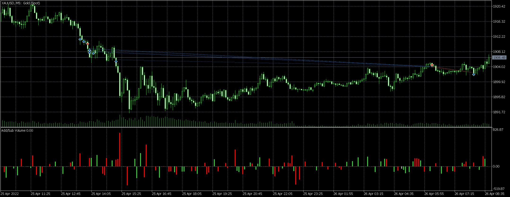

# 25-26

source: `{{ page.path }}`

周一

## 今天犯了无法原谅的错误

上午总结完上周的交易情况, 明显感觉交易手法仍旧存在很大问题, 可能没能吸取教训. 做了几次抄底交易, 成功赢利很多, 人就飘了.

起飘症状:
1. 无畏抄底
2. 不设止损
3. 亏损加仓

可能周五交易太顺利, 也可能之前一直挣钱太顺利, 丝毫没有感觉自己的无知. 但是出来混, 总是要还的, 下午延续上午做法, 继续抄底, 一下子就把自己套住了, 为了解套, 不断加仓, 然后越陷越深. 

想象中的大幅反弹并没有出现, 到了晚上, 大幅下跌的价格, 是我几乎爆仓, 可用保证金已经为负数了, 只有净值尚未清零, 因此苟延残喘了大半夜. 

直至第二天, 勉强止损离场, 保全了半条命.

## 反思

事后那个精明睿智的人是我, 盘中那个无知愚蠢的人也是我. 人总是会犯错, 即使强如利弗莫尔也会犯错, 但我是时候做出一些改变了.

1. 总结这次交易犯了哪些错误
2. 总结这次经验教训
3. 必须制定交易计划

