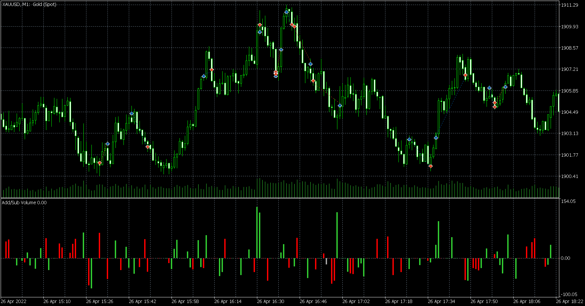
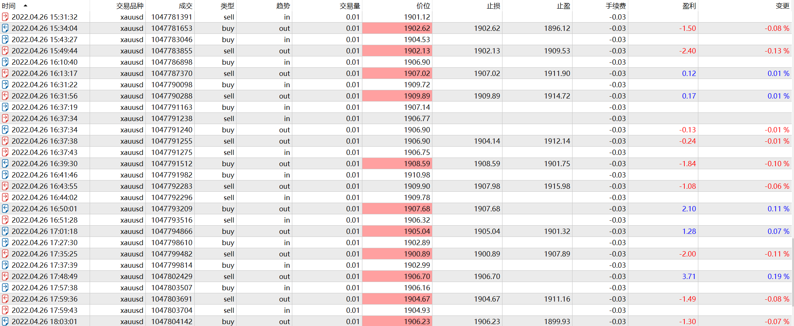

# 26

source: `{{ page.path }}`

## 盘前准备

周二, 20:30发布经济数据, 成交量, 趋势, 震荡一般

## 意料之中

白天总结了昨天爆仓经验, 痛定思痛. 晚上略感疲惫, 但交易今后会成为日常工作, 因此坚持了下来.

今晚严格执行了白天制定的交易规则. 意料之中, 亏了钱.

## 意料之外

1. 20:30居然忘记了宏观数据发布的事情.
2. 亏钱不多
3. 陷入了频繁交易的误区

## 交易过程

1. 20:31, (忘记经济数据发布了), 我判断前面20:25的那根K线是关键K线, 于是价格跌破最低价时, 进场做空, 然后被止损.(如果那是关键K线, 那么之后那几跟K线为何由于呢?)
2. 20:43, 我判断趋势将反转, 价格突破前面高点进场做多.(这里其实突破前一波下跌的起点更稳.)
3. 21:10, 价格突破前方高点, 不过这里发现较晚, 因此进场晚了.
4. 21:30, 价格继续突破, 这里进场又晚了点.
5. 21:37, 这里认为趋势将反转, 价格跌破前方大阳线起点入场做空.(这里没做错)
6. 21:41, 这里价格继续突破, 继续入场做多.
7. 21:44, 突破失败, 这里做空, 不过这笔交易止盈过早了.
8. 21:51, 向下跌破, 继续追空.

总结这一波行情由跌转涨的过程, 行情回调幅度较大, 因此做的不好.

1. 22:27, 认为行情将要反转, 入场做多. (这里明显入场太着急)
2. 22:37, 再次向上突破, 入场做多, 这笔很完美, 止盈点位也很好.
3. 22:57, 这笔交易做的有些莫名其妙了.
4. 22:59, 行情继续向下突破, 追空, 这笔交易虽然亏损, 但问题不大.

## 盘后总结

严格执行设止损, 被动止盈的交易原则, 确实抓取了部分大趋势, 证明这个规则是好的. 

但同时陷入了频繁交易的误区, 而且每次入场略显浮躁. 不过相信以后可以慢慢改善.

今晚行情在1900-1910之间震荡, 明天若突破1910说明趋势向上; 若跌破1900, 说明趋势向下.

