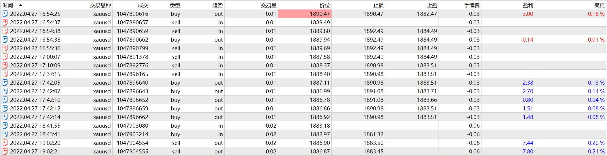

# 27

source: `{{ page.path }}`

## 盘前准备

周三, 无宏观数据, 震荡弱, 趋势弱, 成交量大.(一般成交量大暗示当天出现趋势行情可能性大)

## 交易过程

昨天盘后总结是价格跌破1910, 则看空. 白天价格创下了新低, 因此晚上看空. 
**今晚上的行情说明了前一天的盘后总结多么重要!!!**

1. 20:21, 前面一波上涨过程一直在设sell_stop, 但是一直没能成交. **后面的涨幅连我自己都惊呆了, 但是这也说明顺势入场多么重要, 正确的执行多么重要**, 不过这笔交易入场点有些着急了.
2. 20:48, 向下跌破, 继续看空. (这里下错单了!!!)
3. 21:02, 这里的止盈位设置的太着急了.
4. 21:19, 这里认为行情向上突破, 认为将反转入场做多(这笔交易没毛病).

## 重点分析21:29-21:42

1. 21:31, 这里止盈后, 入场做多, 太着急.
2. 21:33, 行情继续向下突破, 做空没毛病, 但突破失败后应该立即止损
3. 21:36, **这里又犯了抄底的老毛病**. (抄底是多么有有吸引力的事情啊!尤其是一个人连续做错单, 导致意志力薄弱的时候)不过这里我还得给自己点个赞, 即使意志力薄弱, 然而幸好设置了止损.
4. 21:42, 抄底单被止损, 行情向下跌破, 这里追了空单(这里值得赞扬). 不过空单很快平了(这一波跌的太多, 有点怂, 所以这里做的不够好)

## 再遇暴跌场景

1. 21:45, 行情又连续下跌到"83"这个价格, 亏损的状态, 超跌的行情, 敏感的价格, 实在按捺不住抄底的心理. 重仓4手, 而且没设止损(这里重仓抄底情有可原, 没有设止损这个动作, 实在应该批评)
2. 21:52-22:42, 我判断暴跌后会再次跌至最低价附近, 于是主动做空. 不过这里操作手法不够好, 第一笔交易太着急了, 后面的每一笔都是无脑加仓. 最后由于行情反复震荡, 终究还是失了耐心, 平掉了仓位.

## 被动抄底

1. 23:41, 好吧, 就在写交易总结的过程中, 行情最终再次暴跌到了前低附近, 符合之前的判断. 这里, 经历了"暴跌, 回踩"之后, 看着如此低的价格在我面前晃悠, 好吧, 即使现在非常清醒, 似乎也没有什么理由阻止自己抄底. 最后太困了, 也没有精力了, 于是反弹起来就平仓了(这其实是一种不负责任的表现, 既然做了, 应该有始有终才对)

再次声明: 在价格经历了"暴跌", "回踩"之后, 价格再次崩塌至最低点附近, 我才抄底的, 此刻我异常清醒, 即使极具诱惑力, 也克制了4手仓位, 是正常仓位的1倍, 而且严格设置了止损.

## 盘后总结

今晚上行情波动很大, 行情先是向向突破高点(如果不是看空, 可能就追多了), 然后向下暴跌, 跌破最低点. 虽然中途操作不顺利, 但是中间过程并没有亏损太多. **正确的操作永远比正确的判断重要**

对于一个交易者来说, 抄底的诱惑甚至不亚于吸毒, 我想最后的一丝防线应该就是**设止损**了吧.

还有一个重要的启示是: 今天虽然过程很曲折, 但是在每笔交易都设止损的情况下最后终究挣钱了, 因此在交易市场上, 只要不辞辛苦, 耐心等待, 是能够挣到钱的. 等我逐步完善自己的交易方法和心态, 终究是能够挣到大钱的.

经历的今天的暴跌, 明天应该震荡行情, 今晚上下阻力点分别是1880和1890, 行情向上突破, 说明震荡偏强, 向下突破, 说明震荡偏弱.

