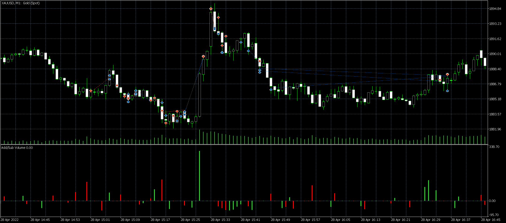
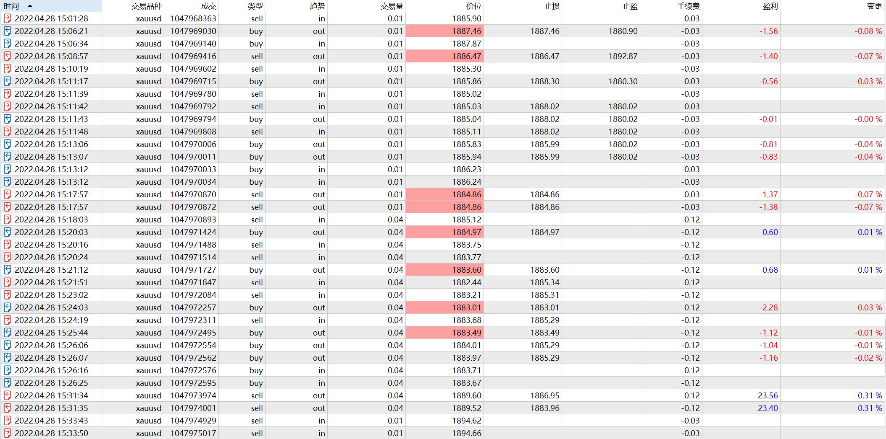
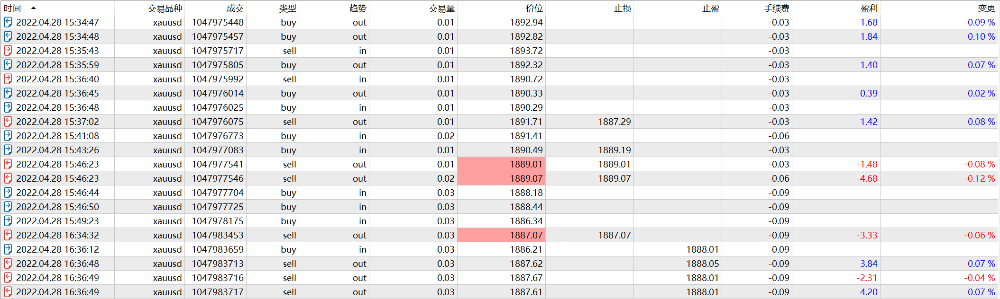

# 28

source: `{{ page.path }}`

## 盘前准备

周四, 20:30经济日历

## 交易不顺

白天价格跌破1880, 今天比较看空. 

然而入场很是不顺利, 20:01-20:25, 行情震荡中, 反复被止损, 心情糟糕透了. 而且随着被止损次数越来越多, 心情越来越差, 下单仓位也越来越重.

20:26, 重仓做多8手, 设置了止损位, 再过几分钟要公布经济数据了, 之前的反复行情让我隐隐感觉到什么. 数据公布后, 行情暴涨, 我也随心止盈了.(这笔违规的交易赢利丝毫没有让我有成就感).

20:33-20:37, 我感觉行情超涨了. 然后做了几手短线.

按照以往的经验, 经济日历公布后, 如果行情暴涨, 回撤之后还会继续上涨的, 于是我继续看多.

20:41-20:49, 也是毫无原则的看多, 抄底, 重仓, 不设止损, 最后熬啊熬, 在21:36全部平仓了.(其实这笔交易不仅错误入场, 而且长时间煎熬后一点钱也没挣到. 我搞不清楚自己在心烦意乱时为何会下单, 只是认清了, 之后折腾疲倦才会收手)

## 经验总结

1. 入场太着急, 被止损后立刻反手导致来回被打脸.
2. 止损设置不合理, 横盘中轻易被止损, 然后追涨杀跌.
3. 心情差就乱下单, 这个习惯很不好.

## 盘后总结

态度不同, 是专业投机者和业余玩家最大的不同. 看来自己还有很长的路要走.

今天晚上除了前两笔交易是正常的, 后面的交易全部没有遵守交易原则, 我也不知道自己何时才能成长起来.

行情维持昨天的判断: 上下阻力点分别是1880和1890, 行情向上突破, 说明震荡偏强, 向下突破, 说明震荡偏弱.

