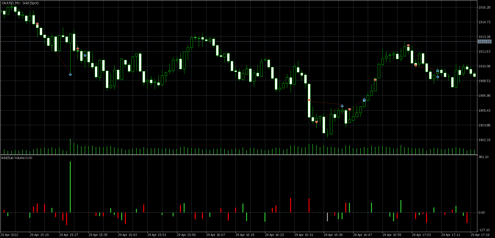
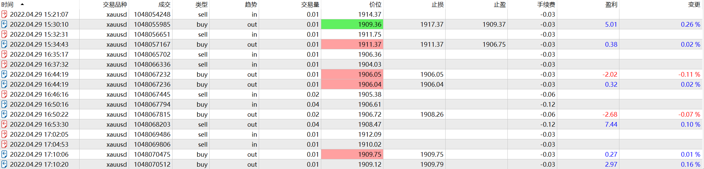

# 29

source: `{{ page.path }}`

## 盘前准备

周五, 20:30有经济日历, 白天行情大幅上涨, 虽然维持震荡偏强观点, 但是感觉有些超涨.

## 交易过程

20:21, 顺势看空, 经济日历发布后, 恰好被止盈.

20:32, 继续看空, 行情下跌后下移止损点被止损(止损移动有些着急, 这也是老毛病).

21:35, 向下跌破, 继续看空, 之后还追加了1手, 然后被止损. 这里被止损后我感觉是"巧合", 于是21:46继续追空.

21:46, 追空操作事后看来是错的, 当时也不改这样做, 只要被止损, 应该等下跌突破再入场.

21:50, 被止损后, 看到行情已经突破, 于是反手做多(这里已经乱了, 因为做多了4手, 超仓了). **错的开始终究是错误的的结果**, 之后又是没有遵守平仓规则, 提前止盈了.

22:02, 看到NinjaTrader的深度行情中, 上方压力较大, 于是入场做空, 之后平仓(这里也没有正常交易).

## 盘后总结

最近两天交易不在状态, 不知道是否为"OrderFlow"烦心.

根据近期的情况, 如果行情向上突破1920, 看多, 跌破1900, 看空.

