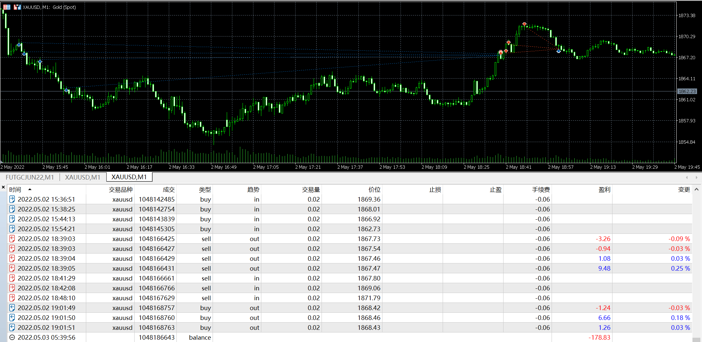

# 02

source: `{{ page.path }}`

## 盘前准备

周一, 没看成交量, 无数据

## 交易太随心

连续忙了几天终于把OrderFlow的事情解决了. 可能需要发泄, 也可能忙糊涂了. 总之今天的第一笔交易是那么的随意, 

上周五判断价格跌破1900看空, 结果当天夜里就跌破了, 今天白天又跌了一天, 价格到了1970附近, 远超出自己的预期, 于是...

重仓, 抄底, 结果又是被套, 加仓, 被套更深...

今天一共两笔交易, 都很简单, 第一笔被套又差点爆仓, 最后回本后立刻平仓了. 第二笔是观察OrderFlow入场交易的, 效果还不错.

## 首次使用OrderFlow

今天首次使用自己编写的OrderFlow确实发现了比较有趣的事情.

21:50, 在1855.8附近主动卖四百多手(超大量), 然后K线居然收阳, 当时已经基本判断是底部, 后面显示果然是最低点.

23:47, 之后连续几根K线, POC总是出现在K线最底部, 而且主动卖量异常大. 我由此判定高点出现, 不过由于之前入场太早(发现多头衰弱迹象便开始加仓导致被套), 没敢继续加仓.

## 盘后总结

最容易造成爆仓的行情不是暴涨暴跌的行情, 反而是那些慢涨慢跌的趋势行情, 这种温水煮青蛙式的行情, 当发现自己深深被套时, 已经几乎无力回天了.

当行情走势和预期出现较大偏差, 需要进行仔细分析.

仍旧感觉行情有些超跌, 不过趋势还是偏空, 我认为短期维持在1860-1870区间震荡概率较大.

是时候把资金取出来了!

