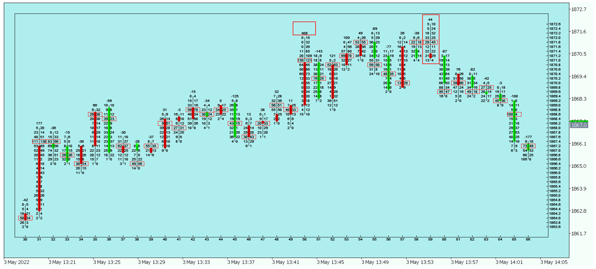
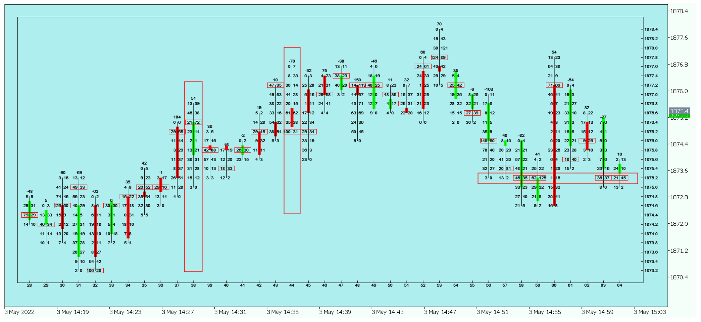
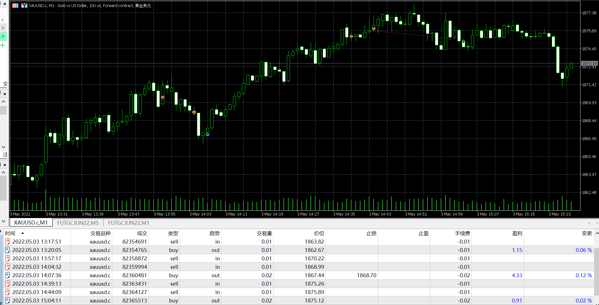

# 03

source: `{{ page.path }}`

**今天开始使用Just2账户, 服务器时间是国际标准时间**

## 盘前准备

周二, 无数据

## 完美离场

21:50, 主动买408手(大单), 价格却收出上引线.
21:50, 主动买44手, 价格却收出长上引线, 都是价格见顶信号.
22:06, 主动卖较多, 价格却收出阳线, 而且POC在K线底部说明下方支撑较强.

## 入场过早

22:38, 主动买较多, 价格却收出阴线, 误以为顶部出现(前一根K线增仓上行, 这一根K线有部分原因是正常回调).

22:44, 价格下跌过程中遇到K线底部大单支撑, 知道自己入场太早(主动入场的苦果),后边果然价格继续上行.

22:56-23:04, 价格回撤过程中仍旧有大量主动买单存在, 买方力量较强, 于是平仓离场.

## 盘后总结

今日首次使用OrderFlow交易, 确实比简单的K线更能看清楚市场强弱. 不过着急抄底摸顶的老毛病仍旧没有改掉.

今日行情如预期震荡, 目前方向不明, 维持1870-1860区间震荡判断.

