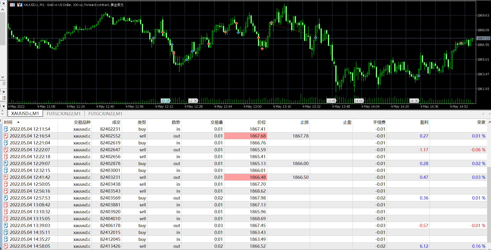

# 04

source: `{{ page.path }}`

## 盘前准备

周三, 凌晨02:00将会有美联储利率决议

## 网络延迟

今天盘中走势和昨日预期一致, 仍旧是区间震荡.不过发生一件事之前从未遇到过的意外"网络延迟".

21:08, 行情向下跌破, 第一笔空单入场, 之后继续加仓做空, 结果遇到反转.

21:15, 高位补仓1手空单, 共计做空3手, 可是行情依旧一路走高.

通过OrderFlow观察, 多空并没有形成明显趋势, 依旧是"震荡"行情, 震荡意味着随时可以在价格回落时安全离场, 于是并没有选择止损.

21:37, 行情如期回落, 平仓离场. 原本显示是略有赢利, 可是查看成交单却大吃一惊, 竟然是"亏损".

仔细查看发现, 原来图表行情延迟3分钟.这是我首次遇到网络延迟问题.

**今后检查网络延迟也将成为一条交易原则**

21:52-22:30, 价格一直处于横盘震荡状态. 我仔细观察OrderFlow, 多空都没有明显压倒性优势, 确认**行情震荡状态**.(底部支撑较强,只不过多方没有主动出击)

震荡意味着突破入场是不明智的, 于是选择回调入场.

22:55, 观察到回调点位合适, 于是入场做多2手, 事实也证明自己的判断正确, 入场点也很正确.

后边行情依旧震荡了十几分钟, 我一直仔细观察, 都是正常的回落. 好几次想过"是否应该在回升后止盈, 回落后重新入场", 但最后被自己否决了, **频繁的交易只会影响自己的判断,很难保证真正突破时刻到来时,自己还有持仓**.

22:58, 行情出现一次突破后, 我仔细观察, 并没有下跌的迹象, 依旧是震荡上行状态. 但是今日已经达到了小目标, 也没有耐心继续忍受震荡的煎熬, 于是平仓离场了.

## 盘后总结

由于凌晨将会发布美联储利率决议, 所以今晚上行情比较"磨唧", 不过已经知道将会有重要事件到来, 对盘面的现象倒是有心理准备, 这就是**及时了解各方信息的重要性**.

今晚的交易更加印证了OrderFlow的强大的威力. 不过值得注意的是, 今晚仍然陷入了**被套的窘境**, 这说明**即使订单流能够帮助我们更加清晰的观察市场, 但是意外事件仍旧时有发生, 交易经验仍需磨炼**.

今晚通过订单流, 很好地处理了震荡行情, 并获得了赢利, 比较顺利.

明天凌晨, 美联储公布利率决议, 行情应该会结束震荡状态.

由于前期市场大幅下跌, 已经消化了加息预期, 因此估计会向上突破, 第一目标位便是1900. 如果价格突破1900, 证明市场完成底部反转, 如果价格没有突破1900, 证明市场仍旧弱势. 如果市场选择向下突破, 那么黄金的牛市应该结束了.

美联储公布决议时中国市场仍旧休市, 因此我对明天的行情走势很期待.

