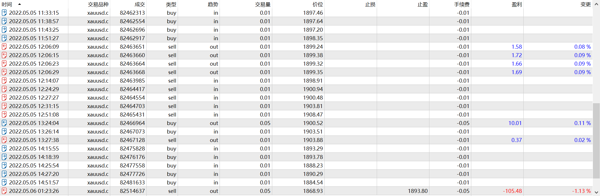

# 05-06

source: `{{ page.path }}`

## 盘前准备

周四, 无宏观数据. 价格如昨日预期突破1900.

## 违规提前入场

因为无事可做, 因此决定提前入场.(这已然违背了交易原则)

19:33, 判断多头较强, 于是入场做多, 超仓做多, 并赢利平仓.(看来自己对超仓已经习以为常)

## 重仓摸顶

20:14, 看到之前空头增仓比较猛, 判断行情反转到来, 于是做空, 结果被套, 然后加仓, 然后又被套...

从我第一笔入场点算起, 最后竟然整整死扛了10美金. 虽然最后侥幸离场, 但是我知道自己错了, 需要休息了.

## 中途反思

我专门出门溜达, 总结自己犯错的原因: 风控太差, 准确说应该是没有风控.

然后告诫自己, 第一笔交易只能1手, 不盈利决不能加仓.

## 仍旧爆仓

22:15, 转眼将刚刚的事情忘记的一干二净. 我认为行情跌太多了. 于是做多2手.(超仓)

22:25, 行情没有如料上涨, 我反而认为是正常回调, 于是又加仓两手. (重仓抄底, 企图摊平亏损)

22:51, 行情继续下跌, 我不忍心割肉, 又加仓1手.(处处犯错)

最后则眼睁睁看着行情不断下跌直至第二天被强平.

## 盘后总结

1. 过度依赖OrderFlow, 反而忽视了价格.
2. 重仓抄底摸顶已经养成了习惯.
3. 没有果断止损, 在缓慢的趋势行情中怀抱"希望", 终究酿成大祸.

