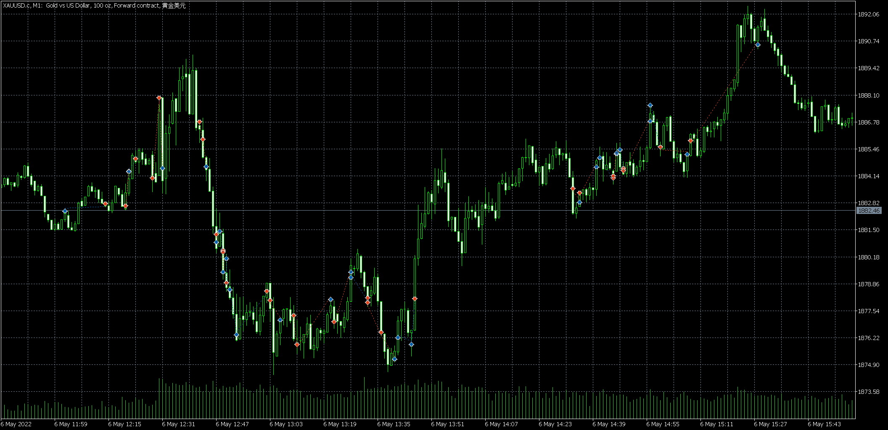

# 06 重大亏损

source: `{{ page.path }}`

## 盘前准备
周五, 美国非农就业数据(不知为何并没有出现在我的统计表中)

## 原则在不断被止损中崩溃

20:20-20:44, 经历非农数据报告, 有些慌张, 有些重仓.

20:47-20:53, 在不断抄底, 比较可贵的是设了止损, 所以没有出现重大亏损.

21:02-21:46, 在行情方向判断中纠结, 行情假突破导致自己不断被止损.

21:45, 此时心情已经崩溃, 重仓5手看多. 最后赌对了, 因此最后平仓离场.

## 中途休息

和昨天一样, 遭遇重大波动后, 出门溜达了一会, 并努力告诫自己遵守交易原则, 吧啦吧啦...

事实证明, 完全无用.

## 重大亏损

22:33-23:08, 开始是1手1手下单的, 经过两次被止损后, 逐步加仓.

在被不断止损的过程中逐渐失去理智, 最终疯狂加仓到8手空单, 而且没有止损.

21:28, 认赔离场.

## 盘后总结

1. 中场休息并没有让自己变得更加理智, 行为反而更加愚蠢
2. 目前已经发现两种情况使自己出现爆仓: 一是缓慢的趋势行情, 自己在不断加仓中爆仓. 二是反复假突破行情, 自己在不断被止损中不断加仓.
3. 行情经历一波趋势之后, 很少出现V型反转, 但是自己常常忽略这件事情, 导致在初期追涨杀跌, 反复被止损.
4. 自己的交易行为很容易因为被止损而受到影响.

