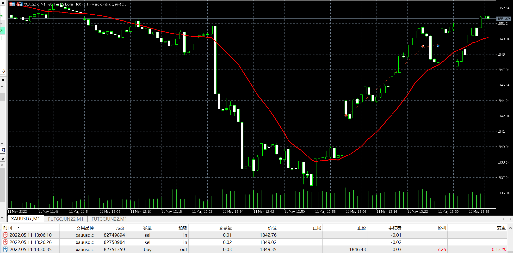

# 11

source: `{{ page.path }}`

## 盘前准备

今日从20:58开始交易, 无盘前准备.

## 超高滑点

21:05, 做空(均线之上不应该做空). 但是成交价比入场价高2美元.

21:26, 加仓做空, 依旧有高达2美元的滑点.

21:30, 平仓, 居然也有2美元滑点.

## 盘后总结

Alpari账户滑点小且稳定, 但是缺乏成交量而且我觉得不安全.

Just2账户看起来很正规而且有成交量数据, 但是我却常常遭遇各种莫名其妙的滑点亏损.

外汇既没有成交量数据, 而且也不安全, 回想这么多年做外汇交易的经历只觉可笑.

