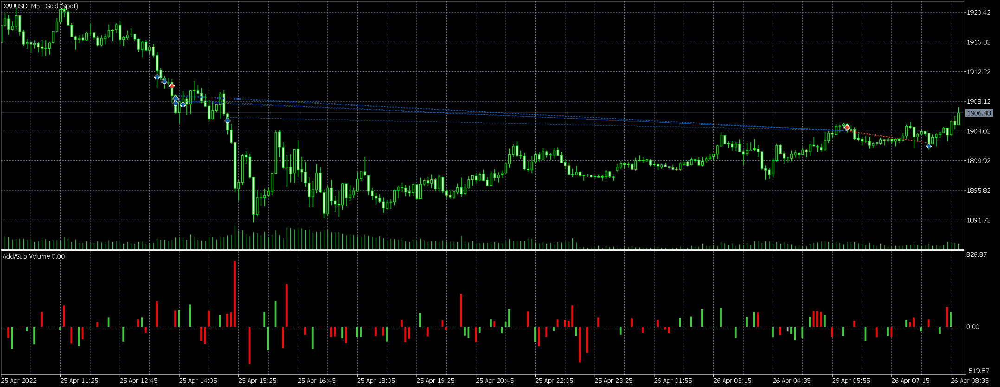

# 爆仓总结20220425

source: `{{ page.path }}`

2022年4月26日

昨天, 几乎爆仓了, 换做以前的我, 肯定爆仓了.

爆仓原因: 
1. 违反交易原则:
   1. 违规在白天交易
   2. 改不掉抄底的习惯
   3. 改不掉不设止损的习惯
2. 对市场认识尚有欠缺
3. 忽视自己前些天对市场的判断

深层次分析:
1. 违规在白天交易是自负的表现
2. 改不掉抄底的习惯是贪婪的表现
3. 改不掉不设止损是输不起的表现
4. 忽视自己盘后总结是无知的表现

## 制定交易原则

1. 只用停止单开仓(避免抄底)
2. 只用止损和回撤止盈单平仓(抓住趋势)
3. 每50美金对应0.01手最大持仓量(避免重仓)
4. 开仓必设止损(赢得起, 输得起)
5. 交易时间19:30-23:30(规范作息)

## 交易计划

每天19:30-20:00做盘前准备, 并制定当晚交易计划.
1. 查看当天宏观数据
2. 查看当天的震荡, 趋势, 成交量数据
3. 查看当天多空交易情况
5. 查看一些支撑阻力点(不要太在意, 执着于支撑和阻力是赔钱的重要原因之一)
6. 查看昨天的盘后总结(盘后比盘中更加清醒, 因此前一天的盘后总结很重要)
7. 总结当前盘面情况(震荡偏多, 假突破偏多, 趋势强弱?)

每天23:00-23:30做盘后总结.
1. 只平不开仓
2. 编写交易日记

## 爆仓的心理变化

这次爆仓一个重要原因是市场并没有突然大幅下跌, 而是一点点下跌, 温水煮青蛙似的下跌, 当发现自己做错时又不舍得割肉, 于是越陷越深.

2022年4月25日

1. 18:38, 今天白天已经下跌超过20美金, 这里应该到底了.
2. 18:59, 嗯?哪里不对, 好像要跌破了, 设置个止损单, 然后跌破瞬间再买回来.
3. 19:10, 底部已经出现, 再加加仓.
4. 20:12, 又跌回来了, 应该很快就会上去, 最后再加一次仓.
5. 20:16, 嗯?情况不大对, 这样子是奔着1900去的, 不过跌破之后应该会迅速反弹. 
6. 20:20, 提心吊胆, 应该到底了吧?
7. 20:34, 至少会反弹到1912.
8. 20:45, 我尼玛, 什么鬼.
9. 20:49, 心态已蹦.
10. 21:16, 至少会反弹到1010之上.
11. 21:57-22:57, 认命了...
12. 22:57-0:57, 多头太弱了, 太困了, 想睡了, 就这样吧...
13. 8:28, 早晚会涨到1910.
14. 9:25, 空头依旧很强悍.
15. 11:18, 半天都不能突破, 多头太弱了, 狠心反手吧.
16. 11:38, 嗯, 下跌趋势不错, 多头就是弱.
17. 11:47-12:25, 空头增仓就下, 减仓就上, 还是空头强.
18. 13:09, 这都跌不下去, 认赔离场吧.
19. 13:42, 明显突破了, 果然是奔着1910去的.
20. 14:18, 突破都能跌回来, 还是空头强.
21. ... 有没有发现最后自己已经语无伦次了.

