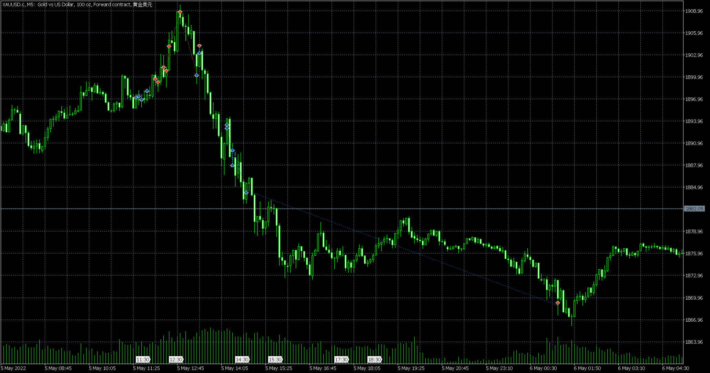

# 爆仓总结20220506

source: `{{ page.path }}`

2022年5月6日

由于昨天的错误, 今天, 爆仓了.

每次不断总结反思, 仍然不断抄底, 重仓, 之前几次侥幸, 终究是逃不掉的.

自己定义的交易原则:
1. 检查网络延迟
2. 只用停止单开仓
3. 每50美金对应1手最大持仓
4. 开仓必设止损
5. 交易时间19:30-23:30

爆仓原因总结:
完完全全违反了所有交易原则.

深层次分析:
1. 过度依赖OrderFlow. 自从有过几次OrderFlow的成功交易之后开始变的过渡自信, 不再坚持自己的交易原则. 
2. 原来没有爆仓部分原因是因为无知所以畏惧, 现在知道太多反而让自己变得自负.
3. 使用新的交易工具对我来说相当于是"改革", 结果果然很很惨.

## 爆仓的心理变化

早在20:14-21:24那段交易中, 我就已经因为逆势增仓使自己陷于险地.

那段交易结束后我还专门出门溜达一会儿, 既是为了放松心情, 也是为了缓解压力, 保持头脑清醒.我就意识到自己风控有问题, 并在心里默默告诫自己第一笔不盈利不能加仓.

然而转眼回到位置上, 我便立刻失去理智, 做多, 逆势加仓, 终究逃不过爆仓命运.

22:15, 价格跌这么多, 已经突破前一个下跌阻力点, 应该要反弹了, 入场1手问题不大. 但是由于网络原因成交价高于入场价.

22:18, 又突破了高点, 再加仓1手.

22:25, 怎么2手单子让我赔了这么多, 目前应该是正常回调, 正好再加仓1手. 前面空头怎么增仓这么猛, 如果涨上去, 空头就死了.

22:27, 果然是回调, 主动买比较多, 再加1手. 

22:51, 应该到底部了, 主动卖的不多了, 最后再加仓1手.

23:05, 完蛋, 跌破了. 惨了, 下一个底部在哪? 上方压力位在哪? 丝毫看不到多头入场.

23:30, 还差一点就突破前压力位了. 多头太弱了.

23:50, 沃日, 彻底没戏了. 跌这么多空头还增仓这么猛, 太惨了.

23:51, 保证金已经变负了. 好恨我自己, 刚反思完就爆仓.

0:41, 太困了, 睡觉了.

